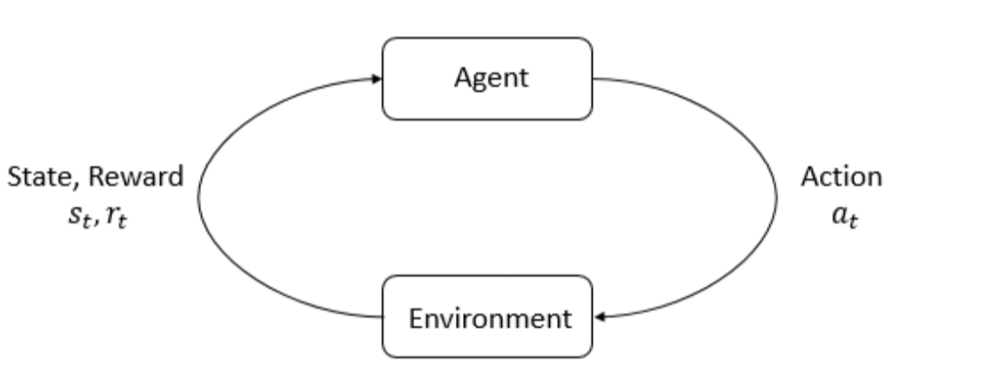

# Deep Reinforcement Learning
## Basics
### What is RL


1. Reinforcement learning (RL) is learning what to do—how to map situations to actions—so as to maximize a numerical reward signal. (RL An Introduction,2018,The MIT Press)

2. Reinforcement learning (RL) is a field of study for algorithms that:
    - Have an agent that interacts with an environment.
    - The goal of the agent is to maximize cumulative reward (called return).

RL is a type of Machine Learning

Machine Learning:
* **Supervised Learning**: Categorize from labeled data
* **Unsupervised Learning**: Tries to find hidden structure from unlabeled data
* **Reinforcement Learning**

**RL and Unsupervised Learning difference**: RL is trying to maximize a reward signal instead of trying to find hidden structure.

### The Goal in RL

The Goal in RL is maximizing the expected cummulative return.

The optimal Policy: $\pi^{*}=\arg \max _{\pi} \underset{\tau \sim \pi}{\operatorname{E}}[R(\tau)]$

The trajectory is according to the policy $\tau \sim \pi$:

$s_{0} \sim \mu(\cdot), \quad a_{t} \sim \pi\left(\cdot | s_{t}\right), \quad s_{t+1} \sim P\left(\cdot | s_{t}, a_{t}\right)$

* **Stochastic Policy**: Select an action randomly according to a probability distribution: $\left(a_{t} \sim \pi\left(\cdot | s_{t}\right)\right)$
* **Deterministic Policy**: The policy directly maps a state to an action: $a_{t}=\pi\left(s_{t}\right)$

### Value Functions and Action-Value Functions

*Value functions indicate which actions you should take to maximize rewards over the long-term (the expected rewards when starting from some given state)*

Value functions provide the expected return after an action or a (state,action) pair.

$V^{\pi}(s)=\underset{\tau \sim \pi}{\operatorname{E}}\left[R(\tau) | s_{0}=s\right]$ Start in $s$ and the continue from there by sampling from $\pi$

$Q^{\pi}(s, a)=\underset{\tau \sim \pi}{\mathrm{E}}\left[R(\tau) | s_{0}=s, a_{0}=a\right]$ Start in $s$ and select action $a$, then sample.

$V^{*}(s)=\max _{\pi} \underset{\tau \sim \pi}{\mathrm{E}}\left[R(\tau) | s_{0}=s\right]$ Optimal Value function, the trajectory maximizes the value function

$Q^{*}(s, a)=\max _{\pi} \operatorname{E}_{\tau \sim \pi}\left[R(\tau) | s_{0}=s, a_{0}=a\right]$ Optimal action value function, the trajectory maximizes the function.

**Recursive Bellman Equations**:

$V^{\pi}(s)=\underset{a \sim \pi \atop s^{\prime} \sim P}{\mathrm{E}}\left[r(s, a)+\gamma V^{\pi}\left(s^{\prime}\right)\right]$

$V^{*}(s)=\max _{a} \operatorname{E}_{s^{\prime} \sim P}\left[r(s, a)+\gamma V^{\pi}\left(s^{\prime}\right)\right]$

$Q^{\pi}(s, a)=\underset{s^{\prime} \sim P}{\mathrm{E}}\left[r(s, a)+{\underset{a^{\prime} \sim \pi}{\gamma\mathrm{E}}}\left[Q^{\pi}\left(s^{\prime}, a^{\prime}\right)\right]\right]$

$Q^{*}(s, a)=\underset{s^{\prime} \sim P}{\mathrm{E}}\left[r(s, a)+\gamma \max _{a^{\prime}} Q^{\pi}\left(s^{\prime}, a^{\prime}\right)\right]$

**Optimal Action**: $a^{*}=\arg \max _{a} Q^{*}(s, a)$

### Experience Replay
* Visit transitions $\left(s, a, s^{\prime}, r\right)$ more than one time step
* Stabilize learning by keeping old transitions in a replay buffer, and taking minibatch
gradient descent **on mix of old and new** transitions

***
***
## Further focus in RL and algorithsm
## Temporal Difference Methods:

* Whereas Monte Carlo (MC) prediction methods must wait until the end of an episode to update the value function estimate, temporal-difference (TD) methods update the value function after every time step.


### Sarsa


* Sarsa(0) (or Sarsa) is an on-policy TD control method. It is guaranteed to converge to the optimal action-value function $q_∗$​, as long as the step-size parameter $\alpha$ is sufficiently small and $\epsilon$ is chosen to satisfy the **Greedy in the Limit with Infinite Exploration (GLIE)** conditions.


### Expected Sarsa


* Sarsamax (or Q-Learning) is an off-policy TD control method. It is guaranteed to converge to the optimal action value function $q_∗$​​, under the same conditions that guarantee convergence of the Sarsa control algorithm.


### Sarsamax


* Expected Sarsa is an on-policy TD control method. It is guaranteed to converge to the optimal action value function $q_*$​, under the same conditions that guarantee convergence of Sarsa and Sarsamax.


## Deep QRLN

We want to approximate the action value function $\hat{q}(S, A, w)$ corresponding to state $S$ and action $A$

$$
\Delta w=\alpha \cdot \underbrace{\overbrace{\left(R+\gamma \max _{a} \hat{q}\left(S^{\prime}, a, w^{-}\right)\right.}_{\text { TD target }}-\hat{q}(\underbrace{S, A, w )}_{\text { old value }})} \nabla_{w} \hat{q}(S, A, w)
$$

Implemented in python ``` loss = F.mse_loss(Q_expected, Q_targets) ```

$w^{-}$ : weights of a separate network (`qnetwork_local` from Udacity exercise) that are not changed during learning

$\left(S, A, R, S^{\prime}\right)$ : Experience tuple


## Value based methods vs policy based methods

* With **value-based methods**, the agent uses its experience with the environment to maintain
an estimate of the optimal action-value function. The optimal policy is then obtained
from the optimal action-value function estimate.

* **Policy-based methods** directly learn the optimal policy, without having to maintain a
separate value function estimate.

* **Policy gradient** methods are a subclass of policy-based methods that estimate the weights of an optimal policy through gradient ascent.

##  There are three reasons why we consider policy-based methods:
* Simplicity: Policy-based methods directly get to the problem at hand (estimating the optimal policy),
  without having to store a bunch of additional data (i.e., the action values) that may not be useful.
* Stochastic policies: Unlike value-based methods, policy-based methods can learn true stochastic policies.
* Continuous action spaces: Policy-based methods are well-suited for continuous action spaces.

## Maximizing expected return over trajectories

maximizing expected return over trajectories (instead of episodes) lets us search for optimal policies for both episodic and continuing tasks!

$$
\text { Trajectory } \tau=\text { state-action sequence }
$$

$$
s_{0}, a_{0}, r_{1}, s_{1}, a_{1}, r_{2}, s_{2}, a_{2}, r_{3},\ldots, s_{H},a_{H}, r_{H},s_{H+1},\ldots
$$


Expected return:

$$
U(\theta)=\sum_{\tau} \mathbb{P}(\tau ; \theta) R(\tau)
$$

find $\theta$ that maximizes expected return
$$
\max _{\theta} U(\theta)
$$

$R(\tau)$ return of trajectory $\tau$

Probability of each trajectory: $\mathbb{P}(\tau ; \theta)$ (depends on weights $\theta$ )

Gradient ascent: $\theta \leftarrow \theta+\alpha \nabla_{\theta} U(\theta)$

$\alpha$ is the step size that is generally allowed to decay over time.

## REINFORCE: $\hat{g} :=\frac{1}{m} \sum_{i=1}^{m} \sum_{t=0}^{H} \nabla_{\theta} \log \pi_{\theta}\left(a_{t}^{(i)} | s_{t}^{(i)}\right) R\left(\tau^{(i)}\right)$


1. Use policy $\pi_{\theta}$ to collect `m` trajectories $\tau^{(1)}, \tau^{(2)}, \ldots, \tau^{(m)}$ with horizon $H$. The `i-th` trajectory: $\tau^{(i)}=\left(s_{0}^{(i)}, a_{0}^{(i)}, \ldots, s_{H}^{(i)}, a_{H}^{(i)}, s_{H+1}^{(i)}\right)$
2. Use trajectories to estimate gradient $\nabla_{\theta} U(\theta)$. $\nabla_{\theta} U(\theta) \approx \hat{g} :=\frac{1}{m} \sum_{i=1}^{m} \sum_{t=0}^{H} \nabla_{\theta} \log \pi_{\theta}\left(a_{t}^{(i)} | s_{t}^{(i)}\right) R\left(\tau^{(i)}\right)$
3. Update the weights of the policy $\theta \leftarrow \theta+\alpha \hat{g}$
4. `loop`

$m$: episodes/trajectories

$H$: how long is the episode/trajectory


**Code**:

$\hat{g} :=\frac{1}{m} \sum_{i=1}^{m} \nabla_{\theta} R\left(\tau^{(i)}\right) \sum_{t=0}^{H} \log \pi_{\theta}\left(a_{t}^{(i)} | s_{t}^{(i)}\right)$

```
for i,log_prob in enumerate(saved_log_probs):
    policy_loss.append(-log_prob * R_sum)
policy_loss = torch.cat(policy_loss).sum()

optimizer.zero_grad()
policy_loss.backward()
optimizer.step()
```


## Derivation of $\nabla_{\theta} U(\theta) \approx \hat{g}=\frac{1}{m} \sum_{i=1}^{m} \sum_{t=0}^{H} \nabla_{\theta} \log \pi_{\theta}\left(a_{t}^{(i)} | s_{t}^{(i)}\right) R\left(\tau^{(i)}\right)$

#### Calculate $\nabla_{\theta} U(\theta)$

$$
\begin{aligned} \nabla_{\theta} U(\theta) &=\nabla_{\theta} \sum_{\tau} P(\tau ; \theta) R(\tau) &(1)\\ &=\sum_{\tau} \nabla_{\theta} P(\tau ; \theta) R(\tau) &(2)\\ &=\sum_{\tau} \frac{P(\tau ; \theta)}{P(\tau ; \theta)} \nabla_{\theta} P(\tau ; \theta) R(\tau) &(2)\\ &=\sum_{\tau} P(\tau ; \theta) \frac{\nabla_{\theta} P(\tau ; \theta)}{P(\tau ; \theta)} R(\tau) &(4) \\ &=\sum_{\tau} P(\tau ; \theta) \nabla_{\theta} \log P(\tau ; \theta) R(\tau) &(5) \end{aligned}
$$

#### Simplify $\nabla_{\theta} \log \mathbb{P}\left(\tau^{(i)} ; \theta\right)$

$$
\begin{aligned} \nabla_{\theta} \log \mathbb{P}\left(\tau^{(i)} ; \theta\right) &=\nabla_{\theta} \log \left[\prod_{t=0}^{H} \mathbb{P}\left(s_{t+1}^{(i)} | s_{t}^{(i)}, a_{t}^{(i)}\right) \pi_{\theta}\left(a_{t}^{(i)} | s_{t}^{(i)}\right)\right] &(1) \\ &=\nabla_{\theta}\left[\sum_{t=0}^{H} \log \mathbb{P}\left(s_{t+1}^{(i)} | s_{t}^{(i)}, a_{t}^{(i)}\right)+\sum_{t=0}^{H} \log \pi_{\theta}\left(a_{t}^{(i)} | s_{t}^{(i)}\right]\right] &(2) \\ &=\nabla_{\theta} \sum_{t=0}^{H} \log \mathbb{P}\left(s_{t+1}^{(i)} | s_{t}^{(i)}, a_{t}^{(i)}\right)+\nabla_{\theta} \sum_{t=0}^{H} \log \pi_{\theta}\left(a_{t}^{(i)} | s_{t}^{(i)}\right) &(3) \\
&=\nabla_{\theta} \sum_{t=0}^{H} \log \pi_{\theta}\left(a_{t}^{(i)} | s_{t}^{(i)}\right) &(4) \\
&=\sum_{t=0}^{H} \nabla_{\theta} \log \pi_{\theta}\left(a_{t}^{(i)} | s_{t}^{(i)}\right) &(5)

 \end{aligned}
$$

$\nabla_{\theta} \sum_{t=0}^{H} \log \mathbb{P}\left(s_{t+1}^{(i)} | s_{t}^{(i)}, a_{t}^{(i)}\right)=0$ because $\sum_{t=0}^{H} \log \mathbb{P}\left(s_{t+1}^{(i)} | s_{t}^{(i)}, a_{t}^{(i)}\right)$ has no dependence on $\theta$

### Noise Reduction

$$
\nabla_{\theta} U(\theta)=\overbrace{\sum_{\tau} P(\tau ; \theta)}^{\text{average over}\\\text{all trajectories}} \underbrace{\left(R_{\tau} \sum_{t} \nabla_{\theta} \log \pi_{\theta}\left(a_{t}^{(\tau)} | s_{t}^{(\tau)}\right)\right)}_{\text{only one is sampled}}
$$

For practical purposes, we simply take one trajectory to compute the gradient, and update our policy. So a lot of times, the result of a sampled trajectory comes down to chance, and doesn't contain that much information about our policy. Hence, noise.


The solution is to sample more trajectories (It can be done in parallel)

$$
\left.\begin{array}{l}{s_{t}^{(1)}, a_{t}^{(1)}, r_{t}^{(1)}} \\ {s_{t}^{(2)}, a_{t}^{(2)}, r_{t}^{(2)}} \\ {s_{t}^{(3)}, a_{t}^{(3)}, r_{t}^{(3)}} \\ {\vdots}\end{array}\right\} \rightarrow g=\frac{1}{N} \sum_{i=1}^{N} R_{i} \sum_{t} \nabla_{\theta} \log \pi_{\theta}\left(a_{t}^{(i)} | s_{t}^{(i)}\right)
$$

### Rewards normalization

In many cases, the distribution of rewards shifts as learning happens. The solution is to normalize the rewards.

$$
R_{i} \leftarrow \frac{R_{i}-\mu}{\sigma} \quad \mu=\frac{1}{N} \sum_{i}^{N} R_{i} \quad \sigma=\sqrt{\frac{1}{N} \sum_{i}\left(R_{i}-\mu\right)^{2}}
$$

### Credit Assignment

Because we have a Markov process, the action at time-step $t$ can only affect the future reward, so the past reward shouldn’t be contributing to the policy gradient.

$$
g=\sum_{t}\left(\ldots+r_{t-1}+r_{t}+\ldots\right) \nabla_{\theta} \log \pi_{\theta}\left(a_{t} | s_{t}\right)
$$

$$
\left(\overbrace{\ldots+r_{t-1}}^{R_{t}^{past}}+\overbrace{r_{t}+\ldots}^{R_t^{future}}\right)
$$

We ignore the past rewards

$$
g=\sum_{t} R_{t}^{\text { future }} \nabla_{\theta} \log \pi_{\theta}\left(a_{t} | s_{t}\right)
$$


### Importance Sampling (recycle trajectories)

After we compute the gradient by sampling a trajectory or a collection of trajectories we dispose them. The reason why we dispose them is because we need to compute the gradient for the current policy, and to do that the trajectories need to be representative of the current policy.

The trajectories we generated with the policy $\pi_{\theta}$, each trajectory had a probability $P(\tau ; \theta)$ to be sampled. By chance the same trajectory can be sampled using the new policy $\pi_{\theta^{\prime}}$ with probability $P(\tau ; \theta^{\prime})$.


Imagine we want to compute the average of some quantity, say $f(\tau)$. We could simply generate trajectories from the new policy, compute $f(\tau)$ and average them.

Mathematically, this is equivalent to adding up all the $f(\tau)$, weighted by a probability of sampling each trajectory under the new policy.

$$
\sum_{\tau} P\left(\tau ; \theta^{\prime}\right) f(\tau)
$$

Rewrite the equation as:

$$
\sum_{\tau} \overbrace{P(\tau ; \theta)}^{\text { sampling under }} \overbrace{\frac{P\left(\tau ; \theta^{\prime}\right)}{P(\tau ; \theta)}}^{\text { re-weighting }} f(\tau)
$$

This is to show that we can reinterpret the first part as the coefficient for sampling under the old policy, with an extra re-weighting factor, in addition to just averaging.

#### The reweighting factor $\frac{P\left(\tau ; \theta^{\prime}\right)}{P(\tau ; \theta)}=\frac{\pi_{\theta^{\prime}}\left(a_{1} | s_{1}\right) \pi_{\theta^{\prime}}\left(a_{2} | s_{2}\right) \pi_{\theta^{\prime}}\left(a_{3} | s_{3}\right) \ldots}{\pi_{\theta}\left(a_{1} | s_{1}\right) \pi_{\theta}\left(a_{2} | s_{2}\right) \pi_{\theta}\left(a_{2} | s_{2}\right) \ldots}$

When some of policy gets close to zero, the re-weighting factor can become close to zero, or worse, close to 1 over 0 which diverges to infinity.
We want to ensure that the reweighting factor is not too far from 1 when we utilize importance sampling.


#### Re-weighting the Policy Gradient

$$
g=\frac{P\left(\tau ; \theta^{\prime}\right)}{P(\tau ; \theta)} \sum_{t} \frac{\nabla_{\theta^{\prime}} \pi_{\theta^{\prime}}\left(a_{t} | s_{t}\right)}{\pi_{\theta^{\prime}}\left(a_{t} | s_{t}\right)} R_{t}^{\mathrm{future}}=\sum_{t} \frac{\nabla_{\theta^{\prime}} \pi_{\theta^{\prime}}\left(a_{t} | s_{t}\right)}{\pi_{\theta}\left(a_{t} | s_{t}\right)} R_{t}^{\text { future }}
$$

Assuming old and current policy is close enough and most of the terms in the Re-weighting factor are 1.

#### The surrogate function

$$
\begin{aligned} g &=\nabla_{\theta^{\prime}} L_{\mathrm{sur}}\left(\theta^{\prime}, \theta\right) \\ L_{\mathrm{sur}}\left(\theta^{\prime}, \theta\right) &=\sum_{t} \frac{\pi_{\theta^{\prime}}\left(a_{t} | s_{t}\right)}{\pi_{\theta}\left(a_{t} | s_{t}\right)} R_{t}^{\mathrm{future}} \end{aligned}
$$

If we keep reusing old trajectories and updating our policy, at some point the new policy might become different enough from the old one, so that all the approximations we made could become invalid.

The big problem is that at some point we hit a cliff, where the policy changes by a large amount. From the perspective of the surrogate function, the average reward is really great. But the actually average reward is really bad! What’s worse, the policy is now stuck in a deep and flat bottom, so that future updates won’t be able to bring the policy back up! we are now stuck with a really bad policy.

#### How do we fix this?

It would be great if we can somehow stop the gradient ascent so that our policy doesn’t fall off the cliff.

$$
L_{\mathrm{sur}}^{\mathrm{clip}}\left(\theta^{\prime}, \theta\right)=\sum_{t} \min \left\{\frac{\pi_{\theta^{\prime}}\left(a_{t} | s_{t}\right)}{\pi_{\theta}\left(a_{t} | s_{t}\right)} R_{t}^{\mathrm{future}}, \operatorname{clip}_{\epsilon}\left(\frac{\pi_{\theta^{\prime}}\left(a_{t} | s_{t}\right)}{\pi_{\theta}\left(a_{t} | s_{t}\right)}\right) R_{t}^{\mathrm{future}}\right\}
$$

We want to make sure the two policies are similar, or that the ratio is close to 1. So we choose a small $\epsilon$ (typically 0.1 or 0.2), and apply the ${\rm clip}$ function to force the ratio to be within the interval $[1-\epsilon,1+\epsilon]$

But we only want to clip the top part and not the bottom part. To do that, we compare this clipped ratio to the original one and take the minimum (show in blue). This then ensures the clipped surrogate function is always less than the original surrogate function $L_{\rm sur}^{\rm clip}\le L_{\rm sur}$, so the clipped surrogate function gives **a more conservative "reward"**.

## PPO:

1. First, collect some trajectories based on some policy $\pi_\theta$​, and initialize theta prime $\theta'=\theta$
2. Next, compute the gradient of the clipped surrogate function using the trajectories
3. Update $\theta'$ using gradient ascent $\theta'\leftarrow\theta' +\alpha \nabla_{\theta'}L_{\rm sur}^{\rm clip}(\theta', \theta)$
4. Then we repeat step 2-3 without generating new trajectories. Typically, step 2-3 are only repeated a few times
5. Set $\theta=\theta'$, go back to step 1, repeat.

## Actor Critic Methods

* Actor critic methods are at the intersection of action value methods and policy based methods. They are using value based techniques to reduce the variance of policy based methods.
* In Actor critic methods all we're trying to do is to reduce the high variance commonly associated with policy based methods. Using a TD critic (baseline) we further reduce the variance of the policy based methods. This leads to faster learning. Also, we see more consistent convergence than policy based methods alone.
* **Actor**: Decreasing the probability of good actions in a losing match is not the best idea (Policy based methods)
* **Critic**: In value based methods you're continually make guesses for the outcome. The guesses improve. (Given that you select good actions)
* In actor critic methods you use the critic to tell good from bad actions more quickly.
* the use of $\theta$​ in some value functions and not in others. This only means that such value function is using a neural network. For example, $V(s;\theta_v)$ is using a neural network as a function approximator, but $A(s,a)$ is not.
* **On Policy**: The same policy is used for interacting with the environment and it's being learned. (Sarsa $Q(S, A) \leftarrow Q(S, A)+\alpha\left[R+\gamma Q\left(S^{\prime}, A^{\prime}\right)-Q(S, A)\right]$ Action already chosen)
* **Off Policy**: The policy interacting with the environment and the policy being learned are different. (DQN $Q(S, A) \leftarrow Q(S, A)+\alpha\left[R+\gamma \max _{a} Q\left(S^{\prime}, a\right)-Q(S, A)\right]$ $a$ is not guaranteed to be used in the next step. It's not necessarily $A'$)

### A2C/A3C


* **A3C**: Instead of using TD-estimate it will use n-step bootstrapping. Doesn't use a replay buffer. On policy method
* **A2C**. Very modular code at https://github.com/ShangtongZhang/DeepRL/ from an Oxford PhD student
* **n-step return**: In one step return $Q(s,a)$ is updated as $L_{i}\left(\theta_{i}\right)=\mathbb{E}\left(r+\gamma \max _{a^{\prime}} Q\left(s^{\prime}, a^{\prime} ; \theta_{i-1}\right)-Q\left(s, a ; \theta_{i}\right)\right)^{2}$ ($S'$ is the state encountered **after** $S$). In n-step return $Q(s,a)$ is updated as $r_{t}+\gamma r_{t+1}+\cdots+\gamma^{n-1} r_{t+n-1}+ \max _{a} \gamma^{n} Q\left(s_{t+n}, a\right)$. So a single reward $r$ directly affects $n$ preceding state-action pairs. Thus the process of propagating rewards to relevant state action pairs more efficient.
* Gradient is different from REINFORCE: $\nabla_{\theta} \log \pi\left(a_{t} | s_{t} ; \theta\right)A\left(a_{t}, s_{t}\right)$ where $A\left(a_{t}, s_{t}\right)=Q\left(a_{t}, s_{t}\right)-V\left(s_{t}\right)$

### DDPG


Critic network: $Q\left(s, a | \theta^{Q}\right)$ , Actor Network: $\mu\left(s | \theta^{\mu}\right)$

Weights Critic: $\theta^{Q}$  Weights Actor $\theta^{\mu}$

Update critic $y_{i}=r_{i}+\gamma Q^{\prime}\left(s_{i+1}, \mu^{\prime}\left(s_{i+1} | \theta^{\mu^{\prime}}\right) | \theta^{Q^{\prime}}\right)$

```
actions_next = self.actor_target(next_states)
Q_targets_next = self.critic_target(next_states, actions_next)
# Compute Q targets for current states (y_i)
Q_targets = rewards + (gamma * Q_targets_next * (1 - dones))
```

$L=\frac{1}{N} \sum_{i}\left(y_{i}-Q\left(s_{i}, a_{i} | \theta^{Q}\right)\right)^{2}$

```
critic_loss = F.mse_loss(Q_expected, Q_targets)
```


$\nabla_{\theta^{\mu}} J \approx \mathbb{E}_{s_{t} \sim \rho^{\beta}}\left[\nabla_{\theta^{\mu}} Q\left.\left(s, a | \theta^{Q}\right)\right|_{s=s_{t}, a=\mu\left(s_{t} | \theta^{\mu}\right)}\right]$

$\nabla_{\theta^{\mu}} J \approx \frac{1}{N} \sum_{i} \nabla_{a} Q\left.\left(s, a | \theta^{Q}\right)\right|_{s=s_{i}, a=\mu\left(s_{i}\right)} \nabla_{\theta^{\mu}} \mu\left.\left(s | \theta^{\mu}\right)\right|_{s_{i}}$

```
actions_pred = self.actor_local(states)
actor_loss = -self.critic_local(states, actions_pred).mean()
```
***

**Tip For Jupyter Notebooks**

## To display animation on the jupyter notebook with some gym environments:

Run a notebook with:

```
xvfb-run -s "-screen 0 1400x900x24" jupyter notebook
```

Inside the jupyter notebook add:

```
import matplotlib.pyplot as plt
%matplotlib inline
from IPython import display
```

Add this function to a cell:

```
def show_state(env, step=0, info=""):
    plt.figure(3)
    plt.clf()
    plt.imshow(env.render(mode='rgb_array'))
    plt.title("%s | Step: %s" % (step, info))
    plt.axis('off')

    display.clear_output(wait=True)
    display.display(plt.gcf())
```

and call after each step:

```
show_state(env,step=t,info="")
```
